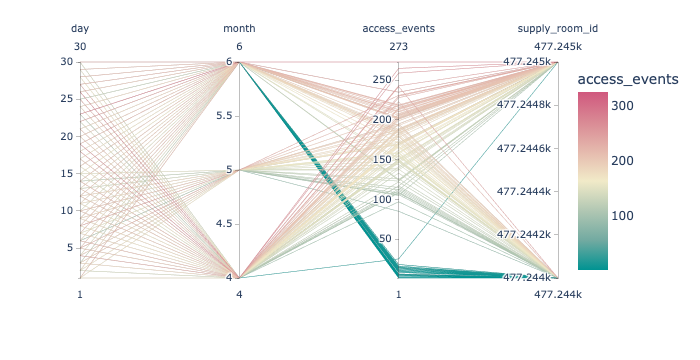
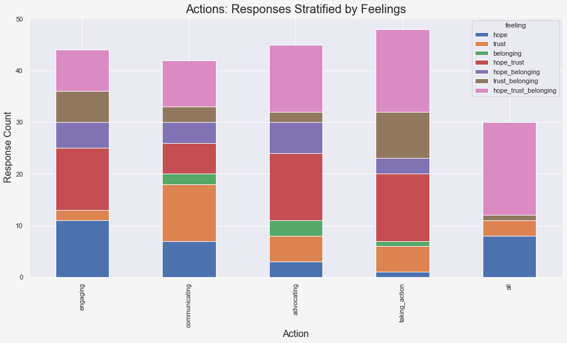

# Bluecoats - A Human-Centric Measurement and Response Program
* **Description**: Bluecoats is a closed-loop, human-centric measurement and response program coordinating training, resources, and operational mechanisms to empower health system staff and management to systematically diagnose issues and develop custom solutions that improve employee wellbeing, streamline operations, and bolster the financial health of the organization.
* **Role**: *Lead Data Scientist* allocated to the Blucoats program
  * **Responsibilities**: Ideation, design, development, implementation, maintenance, and documentation of dedicated processes for:
    * **Opportunity Discovery**: *Analyze enterprise-wide SCORE survey responses* on workplace satisfaction and wellbeing to identify high-opportunity work settings, uits, and positions
    * **Problem-Space Characterization**: *Analyze multi-stage, employee engagement survey responses*, including numerical and free-text data, to surface recurring issues and operational inefficiencies
    * **Project Selection**: *Analyze employee-driven "budgeting exercise" data* to identify the most salient issues for cross-functional project development and implmentation
    * **Project Evaluation**: *Analyze project-specific outcomes* and develop metrics to evaluate project efficacy via historical operational benchmarks, identify areas for further invetigation, and apply root cause analysis as needed
    * **Program Evaluation**: *Analyze collective program outcomes* and develop metrics to evaluate program efficacy via the impact of Bluecoats engagement, communiction, advocacy, and direct actions on employee feelings of hope, trust, and belonging.
    * **Program Expansion**: *Transform analytical results and vizualizations* into an accessible, compelling narrative that inspires key stakeholders and executive leadership to expand the program scale, scope, and span of influence across the University of Pennsylvania Health System.

---

## Select Program Outcomes

---

### Program Expansion - Implementation Architecture Proposal

---

### Opportunity Discovery - SCORE Survey

---

### Problem-Space Characterization - Employee Engagement

---

### Project Selection - Budgeting Exercise

---

### Project Evaluation - Supplies Project
* A recurring issue raised by ED staff, especially nurses, was the difficulty in keeping supply carts stocked both across shifts and during busy periods within shifts; there are two supply closets in the ED at this facility that require swiping an ID card for access.
  * I asked for supply closet swipe data to explore this issue. This was the state of the *raw supply closet swipe data*:

* The **first opportunity** in the *Supplies Project* was to transform this data into a digestible format; the *Chief ED Security Official* was also highly supportive of this endeavor!
  * I identifyed patterns within the noise and reformatted the raw supply closet swipe data into *master supply closet swipe data*:

* With clean, validated data, I was able to calculate the total number of access events, the number of access events per employee, and the number of access events over varying increments of time, among other things.
  * I was then able to calculate various estimates for the "monthly deadweight loss" incurred when searching for scarce, disorganized supplies by combining this data with research studies estimating the average amount of time ED staff spend looking for supplies (**Note**: No memeber of the ED staff was responsible for organizing the supply closets - these estimates are purely due to *operational inefficiencies*, **not** ED staff negligence.):  

  * I was also able to perform an in-depth analysis of supply closet utilization across a number of operational dimensions, such as *day of week* and *day vs night shift*, as demonstrated below (many more such examples can be seen in the corresponding jupyter notebook):

* The **second opportunity** in the *Supplies Project* was to **1)** identify appropriate ED leadership on behalf of the ED staff and **2)** successfuly advocte for a new ED staff position dedicated to keeping supply carts stocked at all times. *The response of the ED staff after the first week was overwhelmingly positive*, both in terms of operational efficiency and workplace wellbeing. Problem solved? Not quite.
  * In a follow-up analysis of supply closet access events over time, hoping to see either a reduction in access events or a substantial shift from general ED staff to the dedicated ED staff member, I noticed something quite peculiar in the data instead - one of the supply closets seemed to stop being used at all!:

* ED staff did not mention the defective scanner despite repeatedly brigning up stocking supply carts as a major issue. The **root problem** only became apparent in the data after the dedicated ED staff member started *tying the supply door open* to avoid unecessary delays while supporting the ED staff. 
* Thus, the **third and final opportunity** in the *Supplies Project* was the identification and replacement of a defective supply closet scanner that had caused **tens of thousands of dollars in monthly losses!** and **was resolved in one day at negligible cost**.

---

### Program Evaluation - Hope, Trust, and Belonging
* The staff-centered, data-driven approach of the Bluecoats Program was a momumental success that is clearly demonstrated both in the final program evaluation report and the enthusiastic expansion of the program to other departments across the health system:

* **Note**: The final clustermap visualizing the *correlation between Bluecoats actions and ED staff feelings* naturally structured the Bluecoats actions - engaging, communicating, advocating, and taking-action - *in the order that they were executed throughout the program lifecycle!* What's more, you can also see a corresponding, positively-sloped correlation structure mapping sequential Bluecoats actions to increasingly powerful single and composite feelings experienced by the ED staff! Oh, and if you look carefully at *any* of the three figures above, we have reinforced, yet again, that *communication builds trust*. 

